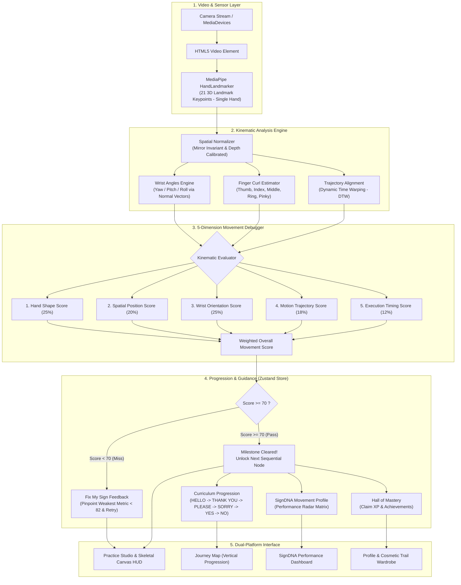

# 🤟 SIGNMIND
### Sign Language Movement Debugger & Interactive Learning Platform

[](https://signmind.vercel.app/)
[](https://react.dev/)
[](https://www.typescriptlang.org/)
[](https://vitejs.dev/)
[](https://tailwindcss.com/)
[](https://ai.google.dev/edge/mediapipe/solutions/vision/hand_landmarker)
[](https://capacitorjs.com/)
[](LICENSE)

**SIGNMIND** is a camera-powered learning platform and movement debugger designed to bridge the practice-feedback gap in sign language education. Using browser-based computer vision and 5-dimensional kinematic analysis, SIGNMIND acts as a personalized movement coach — evaluating hand shape, palm orientation, spatial positioning, motion trajectory, and timing right from a standard camera with zero specialized hardware.

🌐 **Try the Live Application**: **[https://signmind.vercel.app/](https://signmind.vercel.app/)**  
📱 **Android Application Package**: **`com.signmind.app`** (Capacitor Android)

---

## 📌 Problem Statement & The Gap

According to the **World Health Organization (WHO)**:
- Over **1.5 billion people** worldwide live with some degree of hearing loss.
- Approximately **430 million people** have disabling hearing loss requiring rehabilitation services.
- The WHO projects this figure could exceed **700 million by 2050**.

Despite the critical need for inclusive communication, learning sign language independently presents a fundamental practice-feedback gap:

- **The Feedback Void**: Watching an instructional video is easy, but knowing how to evaluate and improve your own physical execution is difficult. Learners cannot easily self-diagnose subtle joint mistakes.
- **Biomechanical Complexity**: Sign language is a three-dimensional spatial language. A slight error in palm tilt, finger curl, or height alters the meaning of a sign.
- **The Black-Box Classifier Problem**: Many experimental machine-learning demos output a simple binary classification ("Correct" or "Incorrect") without explaining *why* a sign was not recognized or *which* physical parameter was off.
- **Hardware Barriers**: Traditional motion-capture solutions or specialized sensor gloves are cost-prohibitive for everyday learners.

---

## 💡 The SIGNMIND Solution

SIGNMIND establishes a structured, iterative learning loop:

$$\text{Learn} \longrightarrow \text{Practice} \longrightarrow \text{Analyze} \longrightarrow \text{Improve} \longrightarrow \text{Retry}$$

### Key Differentiator
Rather than acting as an opaque black-box classifier, **SIGNMIND decomposes every sign attempt into five transparent, actionable movement dimensions**. The system diagnoses the user's specific kinematic bottleneck and provides targeted micro-drills to refine muscle memory.

### Technical Facts & Scope
- **Camera-Based Vision**: Leverages Google MediaPipe Hand Landmarker to extract 21 3D hand keypoints in real time directly inside the browser or native webview.
- **Deterministic Kinematic Evaluator**: Scoring is performed by a custom rule-based kinematic engine using 3D vector geometry, Euler joint angles, and Dynamic Time Warping (DTW) — not an uninterpretable deep-learning black box.
- **Forward-Kinematic Mathematical Baselines**: Reference sign movements are modeled mathematically via canonical forward kinematics rather than uncurated crowd-sourced video sets.
- **Single-Hand Curriculum**: The current version actively tracks and evaluates **one hand** (`numHands: 1`). Two-handed signing is planned for future releases.
- **Client-Side Processing**: Camera video and landmark coordinates are processed locally on device. MediaPipe WASM and model binaries are fetched from a CDN on initial application load.

---

## 🏗️ System Architecture



---

## 📚 Active Curriculum (6 Beginner Signs)

SIGNMIND features a sequenced six-sign beginner curriculum focusing on everyday conversational ASL fundamentals:

| Order | Sign | Phonetic | Primary Movement Pattern |
| :---: | :--- | :--- | :--- |
| **1** | **HELLO** | `/həˈloʊ/` | Open hand near temple, smooth outward lateral trajectory |
| **2** | **THANK YOU** | `/θæŋk juː/` | Flat hand moving forward and down from chin |
| **3** | **PLEASE** | `/pliːz/` | Flat hand in circular motion against chest plane |
| **4** | **SORRY** | `/ˈsɑːri/` | Closed fist circular rubbing motion on chest |
| **5** | **YES** | `/jɛs/` | S-fist tilting up and down from wrist (nodding motion) |
| **6** | **NO** | `/noʊ/` | Index and middle fingers snapping down onto thumb |

---

## 📐 5-Dimension Movement Scoring

Rather than guessing with a black-box classification score, SIGNMIND evaluates attempts across five distinct biomechanical dimensions:

| Dimension | Weight | Mathematical Basis | Description |
| :--- | :---: | :--- | :--- |
| **Hand Shape** | **25%** | Joint curl ratios & inter-digit spacing | Extension and curl of all 5 digits relative to canonical reference posture. |
| **Spatial Position** | **20%** | Euclidean distance relative to anchor | Coordinates of the wrist/hand relative to the face and torso frame. |
| **Wrist Orientation** | **25%** | 3D normal vector dot product | Real-time Yaw, Pitch, and Roll angles calculated from palm normal vectors. |
| **Motion Trajectory** | **18%** | Dynamic Time Warping (DTW) distance | Shape and direction of the movement path compared to the canonical path. |
| **Execution Timing** | **12%** | Phase progression velocity & tempo | Speed consistency, pauses, and overall execution rhythm over time. |

### Scoring & Feedback Thresholds
- **Passing Threshold ($\text{Score} \ge 70$)**: Requires a composite score of 70 or higher to clear a lesson node and unlock the next sign.
- **Coaching & Diagnosis Threshold ($\text{Score} < 82$)**: If the weakest dimension scores below 82, the system flags it as the primary divergence point and generates targeted coaching advice. If all metrics are $\ge 82$, the system confirms balanced technical execution.
> *Note: These values are calibrated scoring thresholds, not statistical accuracy percentages.*

---

## ✨ Implemented Features

### 1. 🎥 Watch & Learn Stage
Prior to camera capture, learners review isolated, canonical video demonstration clips cut specifically for each sign (`HELLO`, `THANK YOU`, `PLEASE`, `SORRY`, `YES`, `NO`). Numbered anatomical cues walk the learner through hand posture and orientation.

### 2. 🚦 Advisory Camera Readiness Check
An integrated pre-flight status card monitors video stream availability, MediaPipe engine initialization, hand presence in the frame, and advisory positioning guidelines to assist the learner prior to recording.

### 3. ⚡ Camera Practice Studio & 21-Point Skeletal HUD
Once in practice mode, the studio renders an interactive skeletal overlay across all 21 landmark vectors with mirrored coordinates aligned to the video feed.

### 4. 🩺 5-Dimension Movement Debugger
Real-time and post-attempt telemetry displays broken-down scores for Hand Shape, Position, Orientation, Trajectory, and Timing.

### 5. 🎯 Fix My Sign — Corrective Micro-Drills
Identifies the single weakest metric below 82, provides actionable movement advice, and allows the learner to immediately execute a focused retry.

### 6. 📊 Before vs. After Attempt Comparison
Compares the learner's latest attempt with their immediately preceding attempt on the **same sign**, visualizing score deltas (+/- changes) to track muscle-memory progression.

### 7. 🧬 SignDNA Movement Profile
Aggregates cumulative attempt telemetry into a 5-axis **Movement Performance Radar**, highlighting natural mechanical strengths and identifying dimensions requiring practice. *(This is an educational performance summary, not biometric identification).*

### 8. 🏆 Leveling, Streaks, Trophies & Cosmetic Trails
- **Elevation Progression**: Advance up Mastery Mountain by clearing lesson nodes.
- **Hall of Mastery Trophies**: Unlock achievements (*First Sign Cleared*, *Kinematic Master*, etc.) to claim XP and Gems.
- **Cosmetic Wardrobe**: Equip custom hand trail effects (Neon Mint, Electric Violet, Medic Pulse, Solar Plasma).
- **Pitch Reset**: A dedicated `RESET DEMO` button resets progress to `HELLO` for demonstration purposes.

### 9. 📱 Unified Dual-Platform Experience (Web + Android)
A single shared React + TypeScript codebase delivers both a responsive web application and an installable native Android package (`com.signmind.app`) via Capacitor.

---

## 🛠️ Tech Stack

| Category | Technologies | Purpose |
| :--- | :--- | :--- |
| **Frontend Framework** | React 19, TypeScript, Vite 8 | Reactive component tree, strict type safety, fast build cycles |
| **Styling & Layout** | Tailwind CSS | Dark cybernetic theme, responsive mobile & desktop viewport layouts |
| **Computer Vision** | Google MediaPipe Tasks-Vision | In-browser 21 3D hand landmark detection (single-hand mode) |
| **Movement Analysis** | Custom Vector Math & DTW | 3D Euler angles, joint-curl geometry, Dynamic Time Warping path alignment |
| **Scoring & Feedback** | Deterministic Kinematic Engine | 5-dimension weighted scoring and rule-based diagnostic coaching |
| **Camera & Video** | MediaDevices API, HTML5 Video | Webcam capture, mirrored video display, autoplay stream management |
| **State & Storage** | Zustand, Browser LocalStorage | Offline-first persisted user progress, streak counting, attempt history |
| **Audio Engine** | Web Audio API | Low-latency synthesized sound cues for countdown, pass, and fail events |
| **Mobile Packaging** | Capacitor 7, Android SDK, Gradle | Native Android application wrapper (`com.signmind.app`) with hardware acceleration |
| **Deployment** | Vercel, GitHub | Continuous deployment for live web application and repository tracking |

---

## 📂 Project Structure

```
SIGNMIND/
├── android/                      # Native Android Capacitor wrapper project
│   ├── app/
│   │   ├── src/main/
│   │   │   ├── AndroidManifest.xml # Permissions (CAMERA, INTERNET, hardware acceleration)
│   │   │   └── java/com/signmind/app/MainActivity.java # WebView media settings
│   │   └── build.gradle          # App build configuration (Java 17, SDK 34+)
│   └── build.gradle              # Top-level Gradle configuration
├── public/
│   ├── emblem.svg                # Brand emblem
│   ├── favicon.svg               # Web favicon
│   ├── manifest.json             # Web App Manifest
│   ├── sw.js                     # Service Worker
│   └── videos/
│       ├── SL.mp4                # Source video reference
│       └── clips/                # Cut clips for each sign (HELLO, NO, PLEASE, SORRY, THANK_YOU, YES)
├── src/
│   ├── components/
│   │   ├── AttemptComparison.tsx # Side-by-side Before vs. After metric diffing
│   │   ├── BottomNav.tsx         # 5-tab mobile navigation with safe-area padding
│   │   ├── CameraReadinessCard.tsx # Pre-flight advisory camera checklist
│   │   ├── FixMySignCard.tsx     # Corrective micro-drills for weakest metric (<82)
│   │   ├── Header.tsx            # Desktop header with audio toggle, reset demo, XP widget
│   │   ├── HomeDashboard.tsx     # Mobile-first dashboard with streak, level, continue CTA
│   │   ├── JourneyMap.tsx        # Vertical 6-node progression path with lock states
│   │   ├── MetricComparisonRow.tsx # Individual metric delta comparison rows
│   │   ├── MissionsView.tsx      # Scenario challenges and checklist progress
│   │   ├── PracticeStudio.tsx    # Core camera workspace, tabbed mobile view, results modal
│   │   ├── ProfileView.tsx       # Trophies, trail wardrobe, altitude tracking
│   │   ├── SignDNAView.tsx       # SignDNA Movement Profile & 5-axis radar chart
│   │   ├── VideoReferencePlayer.tsx # Video playback controller
│   │   └── WatchLearnStage.tsx   # Video introduction & anatomical guide
│   ├── data/
│   │   └── signCatalog.ts        # 6-sign curriculum, phonetic data & canonical frames
│   ├── hooks/
│   │   └── usePracticeEngine.ts  # Single RAF loop, MediaPipe detection, live scoring
│   ├── store/
│   │   ├── progress.ts           # Lesson status, streak calculations & DNA utilities
│   │   └── useSignMindStore.ts   # Zustand root store with persistent LocalStorage syncing
│   ├── utils/
│   │   └── audio.ts              # Web Audio API sound synthesizer
│   ├── vision/
│   │   ├── coach.ts              # Rule-based coaching advice templates
│   │   ├── diagnosis.ts          # Priority divergence point calculation
│   │   ├── drawHand.ts           # Canvas skeletal drawing & joint connection paths
│   │   ├── dtw.ts                # Dynamic Time Warping sequence alignment
│   │   ├── geometry.ts           # 3D vector math, Euler wrist angles, finger curl geometry
│   │   ├── handModel.ts          # Forward kinematics canonical hand constructor
│   │   ├── handTracker.ts        # MediaPipe HandLandmarker initialization
│   │   ├── scoring.ts            # 5-metric tolerance and scoring algorithms
│   │   └── types.ts              # MetricScores, LandmarkFrame, and threshold constants
│   ├── App.tsx                   # Main layout container & tab routing
│   ├── index.css                 # Custom font definitions, styling tokens
│   └── main.tsx                  # Application entry point
├── capacitor.config.ts           # Capacitor configuration (appId: com.signmind.app)
├── package.json
├── tailwind.config.js
├── tsconfig.json
└── vite.config.ts
```

---

## 🚀 Quickstart & Local Setup

### Prerequisites
- [Node.js](https://nodejs.org/) (v18.0.0 or higher recommended)
- Modern web browser with webcam access (Chrome, Edge, Firefox, Safari)

### 1. Clone the repository
```bash
git clone https://github.com/Kanneboinashivakumar/SIGNMIND.git
cd SIGNMIND
```

### 2. Install dependencies
```bash
npm install
```

### 3. Start the development server
```bash
npm run dev
```
Open **`http://localhost:5173`** in your browser and allow camera permissions when prompted.

### 4. Build for production (Web)
```bash
npm run build
```
Generates an optimized production bundle in the `dist/` directory.

---

## 📱 Mobile & Android Native Application

SIGNMIND packages the same React codebase into an Android application via Capacitor:
- **Package ID**: `com.signmind.app`
- **Application Name**: `SIGNMIND`
- **Hardware Acceleration**: Enabled for smooth camera and canvas rendering.

### Android Prerequisites
- [Android Studio](https://developer.android.com/studio) (Giraffe or newer)
- Android SDK (API 34+)
- Java 17 LTS

### Building & Running Android
```bash
# 1. Build the web production assets
npm run build

# 2. Sync web assets and plugins to the Android project
npx cap sync android

# 3. Open in Android Studio
npx cap open android

# Or build the debug APK directly from the command line:
cd android && ./gradlew assembleDebug
```

The compiled debug APK is located at:
```
android/app/build/outputs/apk/debug/app-debug.apk
```

### Testing Options for Evaluators
1. **Direct Web Access**: Open [https://signmind.vercel.app/](https://signmind.vercel.app/) in Chrome or Edge (no installation needed).
2. **Physical Android Device**: Install `app-debug.apk` directly on an Android smartphone.
3. **PC / Mac via Emulator (e.g. BlueStacks)**:
   - Drag and drop `app-debug.apk` into BlueStacks.
   - Ensure the laptop webcam is selected in *BlueStacks Settings → Devices → Camera*.

---

## 🔮 Future Roadmap

The following features represent planned enhancements beyond the current prototype:

1. **Expand Sign Library**: Grow from the 6 core beginner signs to 50+ signs spanning intermediate and advanced conversational tiers.
2. **Advanced Recognition & Two-Handed Gestures**: Extend the kinematic engine to support dual-hand signs (`numHands: 2`), facial expressions, and continuous multi-sign phrases.
3. **Personalized Learning Paths**: Leverage accumulated attempt history to dynamically generate custom practice routines based on individual learning curves.
4. **Long-Term Learning Analytics**: Track historical movement trends to analyze muscle-memory retention and persistent mechanical habits over time.
5. **Wider Accessibility & Offline WASM**: Implement comprehensive offline caching for MediaPipe model binaries to enable practice in low-connectivity environments.
6. **Global Sign Language Support**: Expand curriculum models toward Indian Sign Language (ISL), British Sign Language (BSL), and collaborate with educators and accessibility organizations.

---

## 📄 License

Distributed under the MIT License. See [`LICENSE`](LICENSE) for more information.
