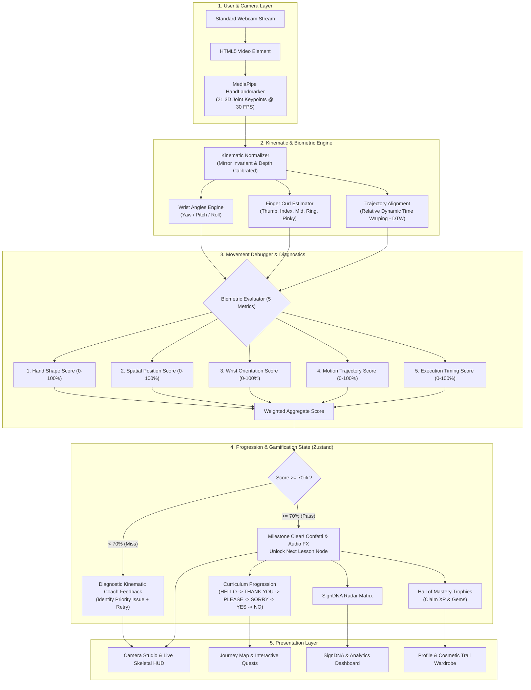

# 🤟 SIGNMIND — AI Sign Language Movement Debugger & Learning Game

[](https://signmind.vercel.app/)
[](https://react.dev/)
[](https://www.typescriptlang.org/)
[](https://vitejs.dev/)
[](https://tailwindcss.com/)
[](https://ai.google.dev/edge/mediapipe/solutions/vision/hand_landmarker)
[](LICENSE)

> 🌐 **Live Prototype**: **[https://signmind.vercel.app/](https://signmind.vercel.app/)** — *Try the interactive camera movement debugger directly in your browser.*

> **Develop a gamified learning platform that helps users learn sign language through interactive challenges and camera-based gesture recognition. The system provides real-time feedback on hand gestures, tracks learning progress, and makes sign-language practice engaging and accessible.**

---

## 📌 Problem Statement & The Gap

Over 70 million deaf individuals worldwide rely on sign language, but learning it online is fundamentally broken:

- **Passive & One-Way**: Watching YouTube videos or flipping flashcards offers zero feedback.
- **Biomechanical Complexity**: Sign language is a 3D physical language. Without feedback, learners have no way of knowing if their finger curl is too tight, their wrist angle is reversed, or their spatial height is off.
- **Black-Box AI**: Most existing computer vision demos provide a binary "Correct / Incorrect" score without explaining *why* you failed or *how* to correct your posture.
- **Inaccessibility**: High-end motion capture gloves or private tutors are cost-prohibitive for the average student.

---

## 💡 The SIGNMIND Solution

**SIGNMIND** transforms sign language education into an accessible, camera-powered video game:

1. **Zero External Hardware**: Runs 100% in any modern web browser using a standard laptop or mobile webcam.
2. **Clinical Movement Debugger**: Deconstructs every attempt across 5 essential biomechanical dimensions rather than guessing with a black-box model.
3. **Adaptive 70% Milestone Progression**: Requires verified $\ge 70\%$ accuracy to advance through sequential curriculum nodes.
4. **SignDNA Biometric Profiling**: Aggregates continuous performance into a personalized muscle-memory radar chart.
5. **Gamified Motivation**: Leveling, daily practice streaks, milestone trophies, cosmetic particle trails, and interactive scenario quests.

---

## 🏗️ System Architecture



---

## ✨ Core Features

### 1. 🎥 Watch & Learn Stage
Before camera capture begins, learners watch isolated, authentic video demonstration clips cut specifically for each sign (`HELLO`, `THANK YOU`, `PLEASE`, `SORRY`, `YES`, `NO`). Numbered anatomical cues walk the learner through hand posture and orientation.

### 2. 🚦 Dynamic Camera Readiness & Pre-Flight Check
Before entering practice mode, SIGNMIND performs real-time pre-flight checks on lighting, camera framing, and hand tracking stability to ensure ideal recording conditions before user attempts begin.

### 3. ⚡ Real-Time Camera Studio & 21-Point Skeletal HUD
Once in practice mode, SIGNMIND renders an interactive skeletal hand overlay across 21 MediaPipe landmark vectors with smooth, real-time performance (~30 FPS).

### 4. 🩺 The 5-Dimension Movement Debugger
Deconstructs every attempt across five biomechanical dimensions:
- **Hand Shape (25%)**: Finger curls and extension across all five digits.
- **Spatial Position (20%)**: Hand coordinates relative to the face and torso.
- **Wrist Orientation (25%)**: Real-time Yaw, Pitch, and Roll angles.
- **Motion Trajectory (18%)**: Dynamic Time Warping (DTW) path alignment against canonical references.
- **Execution Timing (12%)**: Cadence, rhythm, and motion duration.

### 5. 🎯 Fix My Sign — Focused Micro-Drills
When an attempt falls short or reveals a specific weak dimension (<82%), the system pinpoints the weakest metric, provides actionable kinematic coaching instructions, and lets the user run a focused retry drill. When all metrics are $\ge 82\%$, it celebrates technical mastery.

### 6. 📊 Before vs After Attempt Comparison
Learners can compare their latest attempt against their previous attempt side-by-side, visualizing metric deltas (+/- score changes) to track muscle memory progress over time.

### 7. 🧬 SignDNA Profile & Biometric Radar
Aggregates continuous practice telemetry into a 5-axis kinematic radar chart, identifying natural biomechanical strengths and pinpointing dimensions needing calibration.

### 8. 🏆 Mastery Progression & Gamification
- **70% Passing Threshold**: Clear progression requirements to advance through sequential curriculum nodes.
- **Mastery Journey**: Climb elevation on Mastery Mountain with daily practice streaks.
- **Claimable Trophies**: Unlock achievements (e.g., *First Sign Cleared*, *Kinematic Master*) to earn XP and Gems.
- **Cosmetic Wardrobe**: Equip custom hand particle trails (Neon Mint, Electric Violet, Medic Pulse, Solar Plasma).
- **1-Click Pitch Reset**: A dedicated `RESET DEMO` button in the header resets the curriculum to `HELLO` for demonstration purposes.

---

## 🛠️ Tech Stack

| Domain | Technology | Purpose |
| :--- | :--- | :--- |
| **Framework** | React 19 + TypeScript | Strict typing, reactive state, component modularity |
| **Build Tool** | Vite 8 | Sub-second HMR, optimized production rollup |
| **Styling** | Tailwind CSS | Modern cybernetic dark-mode UI with fluid layouts |
| **Computer Vision** | Google MediaPipe Tasks-Vision | In-browser 21 3D hand landmark detection |
| **Kinematic Engine** | Custom Vector Math + DTW | 3D Euler angles, finger curl geometry, dynamic time warping |
| **State Management**| Zustand | Lightweight persisted store with localStorage syncing |
| **Audio Engine** | Web Audio API | Low-latency synthesized biometric audio feedback |
| **FX & Animation** | Canvas-Confetti + CSS | Reward particle systems and HUD glow animations |

---

## 📂 Project Structure

```
SIGNMIND/
├── public/
│   ├── emblem.svg                # Brand emblem
│   ├── favicon.svg               # Web favicon
│   ├── manifest.json             # PWA manifest
│   ├── sw.js                     # Service worker
│   └── videos/
│       ├── SL.mp4                # Source video for Restaurant Quest
│       └── clips/                # Standalone cut clips per sign
│           ├── HELLO.mp4
│           ├── NO.mp4
│           ├── PLEASE.mp4
│           ├── SORRY.mp4
│           ├── THANK_YOU.mp4
│           └── YES.mp4
├── src/
│   ├── components/
│   │   ├── AttemptComparison.tsx # Before vs After attempt metric diffing
│   │   ├── BottomNav.tsx         # Mobile navigation bar
│   │   ├── CameraReadinessCard.tsx # Pre-flight camera readiness checklist
│   │   ├── FixMySignCard.tsx     # Corrective micro-drills for weakest metric
│   │   ├── Header.tsx            # Top nav, audio toggle, RESET DEMO, XP widget
│   │   ├── HomeDashboard.tsx     # Hero overview & daily quest gateway
│   │   ├── JourneyMap.tsx        # Visual node-based sign progression path
│   │   ├── MetricComparisonRow.tsx # Metric breakdown comparison rows
│   │   ├── MissionsView.tsx      # Multi-phrase conversational scenario challenges
│   │   ├── PracticeStudio.tsx    # Core camera workspace, debugger, modal
│   │   ├── ProfileView.tsx       # Trophies, trail wardrobe, altitude tracking
│   │   ├── SignDNAView.tsx       # Biometric analytics & radar chart
│   │   ├── VideoReferencePlayer.tsx # Embedded tutorial video player
│   │   └── WatchLearnStage.tsx   # Step 1 video introduction & anatomical guide
│   ├── data/
│   │   └── signCatalog.ts        # Canonical ASL FK landmarks, timing & metadata
│   ├── hooks/
│   │   └── usePracticeEngine.ts  # MediaPipe webcam loop, scoring, live metrics
│   ├── store/
│   │   ├── progress.ts           # Streak and lesson calculation utilities
│   │   └── useSignMindStore.ts   # Zustand root store with persistent state
│   ├── vision/
│   │   ├── coach.ts              # Biomechanical coaching templates
│   │   ├── diagnosis.ts          # Priority issue divergence analysis
│   │   ├── drawHand.ts           # Canvas skeletal rendering & visual cues
│   │   ├── dtw.ts                # Dynamic Time Warping trajectory comparison
│   │   ├── geometry.ts           # Vector math, Euclidean distance, normal vectors
│   │   ├── handModel.ts          # Forward kinematics canonical hand constructor
│   │   ├── handTracker.ts        # MediaPipe landmarker initialization & detection
│   │   ├── scoring.ts            # 5-metric comparison and tolerance algorithms
│   │   └── types.ts              # Landmark, metric score, and sign type definitions
│   ├── App.tsx                   # Main dynamic layout router
│   ├── index.css                 # Custom font definitions and cybernetic tokens
│   └── main.tsx                  # Application mount
├── package.json
├── tailwind.config.js
├── tsconfig.json
└── vite.config.ts
```

---

## 🚀 Quickstart & Local Setup

### Prerequisites
- [Node.js](https://nodejs.org/) (v18.0.0 or higher recommended)
- Modern web browser with webcam access (Chrome, Edge, Safari, Firefox)

### 1. Clone the repository
```bash
git clone https://github.com/Kanneboinashivakumar/SIGNMIND.git
cd SIGNMIND
```

### 2. Install dependencies
```bash
npm install
```

### 3. Start the development server
```bash
npm run dev
```
Open **`http://localhost:5173`** in your browser. Grant camera permissions when prompted.

### 4. Build for production
```bash
npm run build
```
Generates an optimized production bundle in the `dist/` folder.

---

## 🔮 Future Roadmap

- [ ] **Real-World Reward Economy**: Convert accumulated XP / Gems (e.g. at 1,000 XP) into partner coupons, gift cards, and educational vouchers.
- [ ] **Two-Handed Dialogue AI**: Extend kinematics to multi-sign conversational scenarios with full sentence parsing.
- [ ] **Multilingual Sign Catalogs**: Support for Indian Sign Language (ISL) and British Sign Language (BSL).
- [ ] **Offline PWA Installation**: Full offline caching of MediaPipe WASM models for low-bandwidth environments.

---

## 📄 License
Distributed under the MIT License. See `LICENSE` for more information.
